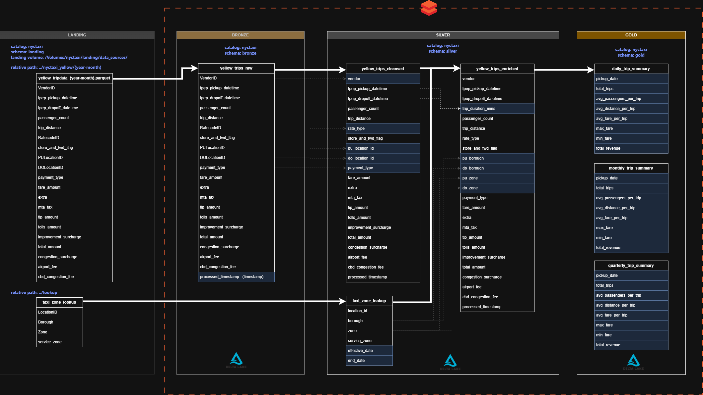

# NYC Taxi Databricks Project — Medallion Architecture | Delta Lake | Unity Catalog

## 🧠 Overview
This end-to-end project demonstrates how to design and implement a **governed, scalable, and analytics-ready data pipeline** using **Azure Databricks**, **Unity Catalog**, and **Delta Lake** following the **Medallion Architecture** (Landing → Bronze → Silver → Gold).  
The dataset used is the **NYC Yellow Taxi Trip Dataset**, transformed from raw Parquet files into structured analytical tables.

---

## 🧩 Architecture Overview

### 🏗 Architecture Flow
1. **Landing Layer** – Raw Parquet data files stored as Databricks Volumes  
2. **Bronze Layer** – Stores raw ingested tables (`yellow_trips_raw`, `taxi_zone_lookup`)  
3. **Silver Layer** – Cleansed and enriched data (`yellow_trips_cleansed`, `yellow_trips_enriched`)  
4. **Gold Layer** – Aggregated analytics tables (`daily_trip_summary`, `weekly_trip_summary`, `monthly_trip_summary`, `quarterly_trip_summary`)

---

## 🪄 Project Highlights
- 🚀 Implemented **Medallion Architecture** using Databricks and Delta Lake  
- 📥 Automated **data ingestion** using a custom Python function into Landing Volumes  
- 🧭 Configured **Unity Catalog** for multi-layer governance  
- ⚙️ Applied **Delta Lake features** such as Time Travel, Vacuum, Cloning, and Optimization  
- 📊 Generated **aggregated insights** including daily, monthly, and quarterly trip metrics  

---

## ⚙️ Data Flow

### 1️⃣ Landing Layer
Raw Parquet files ingested from the NYC Taxi public dataset are stored as **Databricks Volumes**.  
- **Catalog:** `nyctaxi`  
- **Schema:** `landing`  
- **Relative Path:** `/Volumes/nyctaxi/landing/data_sources/`  
- **Files:**  
  - `yellow_tripdata_{year_month}.parquet`  
  - `taxi_zone_lookup.parquet`

### 2️⃣ Bronze Layer
Stores unprocessed raw tables with schema validation and metadata tracking.  
- Table: `yellow_trips_raw`  
- Transformations: Basic type casting, ingestion timestamp addition

### 3️⃣ Silver Layer
Cleaned and enriched data — fixing datatypes, deriving trip duration, and joining with lookup zones.  
- Tables:  
  - `yellow_trips_cleansed`  
  - `yellow_trips_enriched`  
- Joins performed with `taxi_zone_lookup` for `borough`, `zone`, and `service_zone`

### 4️⃣ Gold Layer
Aggregated tables for analytical dashboards.  
- Tables:  
  - `daily_trip_summary`
  - `weekly_trip_summary` 
  - `monthly_trip_summary`  
  - `quarterly_trip_summary`  
- Metrics include: `total_trips`, `avg_passengers_per_trip`, `avg_distance_per_trip`, `total_revenue`, `min_fare`, `max_fare`

---

## 🧰 Tech Stack

| Category | Tools / Technologies |
|-----------|----------------------|
| Platform | Azure Databricks |
| Storage | Databricks Volumes, ADLS Gen2 |
| Data Format | Parquet, Delta Tables |
| Governance | Unity Catalog |
| Language | PySpark, SQL |
| Architecture | Medallion (Landing → Bronze → Silver → Gold) |
| Versioning | Delta Lake Time Travel |
| Visualization | Power BI (optional for analytics) |

---

## 🧱 Unity Catalog Configuration

| Step | Description |
|------|--------------|
| 1️⃣ Create Metastore | Centralized governance layer for Databricks workspace |
| 2️⃣ Create Credentials | Secure access for data lake volumes |
| 3️⃣ Create External Locations | Landing, Bronze, Silver, and Gold zones |
| 4️⃣ Create Catalogs & Schemas | `nyctaxi.00_landing`, `nyctaxi.01_bronze`, `nyctaxi.02_silver`, `nyctaxi.03_gold` |

---

## 📓 Project Notebooks

| Layer | Notebook | Description |
|--------|-----------|-------------|
| 🟢 Landing | `00_landing.ipynb` | Ingest Parquet files into Databricks Volumes |
| 🟤 Bronze | `01_bronze.ipynb` | Create raw Delta tables from Landing data |
| ⚪ Silver | `02_silver.ipynb` | Cleanse, validate, and enrich trip data |
| 🟡 Gold | `03_gold.ipynb` | Build analytical summary tables |

Each notebook is included in the [`notebooks/`](./notebooks) directory.

---

## 💾 Datasets

📁 **`/Volumes/nyctaxi/landing/data_sources/`**

| File | Description |
|------|--------------|
| `yellow_tripdata_{year_month}.parquet` | Raw trip records with timestamps, fares, and passenger details |
| `taxi_zone_lookup.parquet` | Lookup file containing borough, zone, and service area mapping |

🗂 **Dataset Source:**  
The NYC Taxi Trip dataset is publicly available on the official [NYC TLC Trip Record Data Portal](https://www.nyc.gov/site/tlc/about/tlc-trip-record-data.page)

---

## 🧭 Key Learnings
- Built an **end-to-end Databricks ETL pipeline** using Parquet data sources  
- Learned to manage **Unity Catalog** objects for structured governance  
- Gained hands-on experience with **Volumes** and **Delta Lake architecture**  
- Practiced **incremental data processing** and **schema evolution**  
- Enhanced understanding of **data lineage, reliability, and reproducibility**

---

## 👨‍💻 Author
**Rishikesh Gundla**  
📊 *Senior Business Intelligence Engineer | Data Engineering & Analytics Enthusiast*  
🔗 [LinkedIn](https://www.linkedin.com/in/rishikeshgundla)
